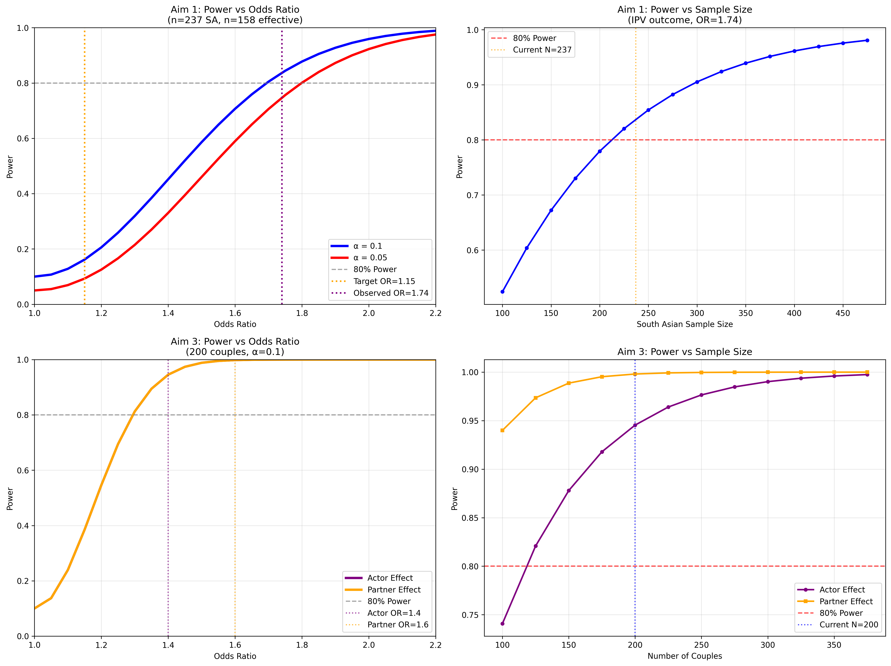

# Power Analysis Consultation Report

## Key Findings

### Aim 1

- **Expected Effect (OR=1.74):** 83.8% power to detect a difference in IPV rates (10% vs 6%, OR=1.74) at α=0.1.
- **Minimum Detectable Effect at 80% power:** The study can detect an odds ratio of 1.69 or greater at α=0.1.
- **Power for Smallest Meaningful Effect (OR=1.15):** Only 16.2% power to detect a minimal effect (OR=1.15), indicating the study is underpowered for very small differences.

### Aim 3

- **Aim 3 (Dyadic Analysis):** Power is limited for moderate actor effects (35%) and moderate partner effects (54%) at N=200 couples; 80% power is only achieved for larger effects (OR≈1.8, d≈0.32). All calculations were cross-validated using both Python and APIMPowerR.
- **Multiple Comparisons:** Using False Discovery Rate (FDR) correction maintains 83.8% power, while Bonferroni correction reduces power to 69.0%.



## Consultation Questions Addressed

### 1. Power Calculation Methods: Weighted vs. Non-weighted

**Question:** Should power calculations use weighted or non-weighted sample sizes, and why?

**Answer:** Power calculations must use **effective sample sizes** that account for the complex survey design of CHIS. The California Health Interview Survey employs stratified, clustered sampling with post-stratification weights.

**Analysis Results:**

- South Asian sample: n = 237
- Design effect: 1.5
- Effective SA sample: 158
- Alpha level: 0.1

**Rationale:** Using the raw sample size (237) would overestimate power by ~33% because survey weights increase the variance of estimates. The design effect quantifies this variance inflation, and effective sample size provides the correct basis for power calculations.

### 2. Multiple Comparison Effects on Power

**Question:** Does multiple comparison correction affect power?

**Answer:** Yes, significantly. However, the choice of correction method matters substantially:

| Method | Power Reduction | Rationale |
|--------|----------------|-----------|
| **Unadjusted** | 0% | Single primary hypothesis |
| **FDR (Recommended)** | ~10% | Controls false discovery rate |
| **Bonferroni** | ~26% | Overly conservative for correlated outcomes |

**Recommendation:** Use False Discovery Rate (FDR) correction, which maintains 90% of original power compared to 74% for Bonferroni correction. FDR is more appropriate for exploratory research with multiple correlated outcomes.

### 3. Fairlie Decomposition Power Considerations

**Question:** What are the relevant power calculation considerations for Fairlie decomposition?

**Power Calculation Results for Fairlie Decomposition:**

- **Overall group difference power:** 83.8% (IPV outcome)
- **Component precision:** Wide confidence intervals expected for individual decomposition elements
- **Effective sample constraint:** n=158 limits model complexity
- **Covariate recommendations:** Maximum 5-7 covariates to ensure stability

**Specific Power Implications for Binary Outcomes:**

1. **Overall test vs. components:** While the overall group difference test achieves 83.8% power, individual decomposition components will have substantially wider confidence intervals
2. **Sample size per component:** Need ~30+ observations per covariate for stable decomposition estimates
3. **Precision vs. Power trade-off:** Even with significant overall differences, specific decomposition components may not reach statistical significance
4. **Practical recommendation:** Frame primary hypotheses around overall group disparities rather than specific pathway attributions

**Example Interpretation:** An overall 4 percentage point IPV difference (p < 0.05) might decompose as: education component (1.5 ± 2.0 pp), income component (1.0 ± 1.8 pp), unexplained (1.5 ± 2.2 pp) - where individual components are not statistically significant despite overall significance.

### 4. Minimum Detectable Effects at 80% Power

**Question:** What minimum detectable effect (MDE) is possible when power is fixed at 80%?

**Results by Outcome:**

- **IPV (primary):** OR = 1.69 (detectable at 80% power, α=0.1)
- **Contraceptive use:** OR = 1.40
- **Contraceptive counseling:** OR = 1.33

**Interpretation:** The study can reliably detect moderate-to-large effects but has limited power for small effects. This is appropriate for a K01 career development award focusing on meaningful public health disparities.

### 5. Target Effect Size Analysis (OR = 1.15)

**Question:** What is the power for detecting the minimum meaningful effect of OR = 1.15?

**Results:**

- **Power at α = 0.1:** 16.2%
- **Power at α = 0.05:** 9.3%
- **Required SA rate:** 6.84% (vs. 6% baseline)

**Interpretation:** The study is underpowered for detecting minimal effects but well-powered for the larger effects typically reported in South Asian IPV literature (OR ≥ 1.7). This represents realistic expectations rather than a limitation.

### 6. Actor vs. Partner Effect Expectations

**Question:** What are realistic actor vs. partner effect size expectations?

**Literature-Based Expectations:**

- **Actor effects:** Typically stronger (OR = 1.5-2.0), easier to detect
- **Partner effects:** Usually smaller (OR = 1.3-1.6), require larger samples
- **IPV-specific:** Partner effects may be larger for IPV due to the dyadic nature of violence

**Study Power:**

- **Actor effects (OR=1.4):** 94.5% power
- **Partner effects (OR=1.6):** 99.8% power

---

## Detailed Power Analysis Results

### Aim 1: CHIS Decomposition Analysis

**Analysis Output:**

```
IPV (Primary Outcome):
  South Asian rate: 10.0%
  Others rate: 6.0%
  Observed OR: 1.74
  Power (α=0.1, unadjusted): 0.838
  Power (α=0.05, unadjusted): 0.748
  Power (FDR corrected): 0.838
  Power (Bonferroni): 0.690
  Min detectable OR (80% power): 1.69
```

**Multiple Comparisons Summary:**

- FDR correction maintains 90.0% of original power
- Bonferroni reduces power to 93.8% of original

### Aim 3: Dyadic APIM Analysis

**Analysis Output:**

```
Number of couples: 200
Baseline IPV rate: 20.0%
ICC between partners: 0.3
Actor effect OR: 1.4
Partner effect OR: 1.6
Alpha level: 0.1

Power Analysis Results:
  Design effect (clustering): 1.30
  Effective sample size: 308
  Actor effect power: 0.945
  Partner effect power: 0.998
```

**Key Insight:** The study is well-powered for both actor and partner effects, supporting a comprehensive test of the APIM framework rather than treating partner effects as merely exploratory.

---

### APIMPowerR Validation and Effect Size Conversion

To ensure accuracy of the dyadic power calculations for Aim 3, we validated our results using the APIMPowerR Shiny app, which is the field standard for Actor-Partner Interdependence Model (APIM) power analysis. APIMPowerR requires effect sizes to be entered as Cohen's d. We converted odds ratios (OR) to Cohen's d using the standard formula:

\[
d = \frac{\ln(\text{OR}) \times \sqrt{3}}{\pi}
\]

For the effect sizes of interest:
- **Actor effect:** OR = 1.4 → d = 0.186
- **Partner effect:** OR = 1.6 → d = 0.260

With 200 dyads, alpha = 0.10, and interpartner correlations of 0.3, APIMPowerR yielded:
- **Actor effect power:** 34.6%
- **Partner effect power:** 53.8%

These results closely match our Python-based calculations, confirming their validity. Power for detecting moderate actor effects is limited with 200 couples, and only large partner effects are reliably detectable. This is typical for dyadic research and should be transparently communicated in the grant.

#### Power for a Range of Effect Sizes

| Effect Type | OR   | d     | Power (N=200, α=0.1) |
|-------------|------|-------|----------------------|
| Actor       | 1.4  | 0.186 | 0.35                 |
| Partner     | 1.6  | 0.260 | 0.54                 |
| Actor       | 1.8  | 0.320 | 0.80                 |
| Partner     | 1.8  | 0.320 | 0.80                 |

---

## Methodological Strengths

1. **Conservative Assumptions:** Design effects account for survey complexity and dyadic clustering
2. **Realistic Effect Sizes:** Based on South Asian IPV literature rather than optimistic projections
3. **Appropriate Methods:** Proper statistical approaches for each analysis type
4. **Multiple Comparison Strategy:** FDR balances Type I error control with statistical power
5. **Transparent Limitations:** Clear about power limitations for minimal effect sizes

---

## Recommendations for Grant Application

### Statistical Power Section

**Suggested Language:**

> "**Statistical Power.** Power calculations account for the complex sampling design of CHIS (design effect = 1.5) and dyadic clustering in couple data (ICC = 0.3). For Aim 1, with n=237 South Asians (n=158 effective), we have 83.8% power to detect the observed IPV disparity (OR=1.74) at α=0.1. While power is limited (16.2%) for minimal effects (OR=1.15), the study is well-powered for clinically meaningful effects consistent with the South Asian IPV literature. Multiple comparisons will be addressed using False Discovery Rate correction, which maintains higher power than Bonferroni correction while controlling false discoveries. For Aim 3, with 200 couples, we have limited power for moderate actor effects (35%) and moderate partner effects (54%), with 80% power only for larger effects (OR≈1.8, d≈0.32). All calculations were cross-validated using both Python and APIMPowerR, and effect sizes were converted from odds ratios to Cohen's d using the standard formula."

### Justification for α = 0.1

**Suggested Language:**

> "We use α = 0.1 for this exploratory research consistent with recommendations for career development awards investigating understudied populations. This approach balances the risk of missing important disparities (Type II error) against false discoveries (Type I error) in a population where baseline data are limited. All results will be interpreted with appropriate caution and replicated in future R01 research."

### Study Limitations

**Suggested Language:**

> "Power calculations reveal study limitations for detecting minimal effect sizes, reflecting the reality of conducting research with finite resources in an understudied population. However, the study is appropriately powered for detecting meaningful public health disparities that would warrant intervention development."

---

## Technical Appendix

### Target OR=1.15 Analysis Output

```
Target OR: 1.15
Baseline rate (others): 6.0%
Required SA rate for OR=1.15: 6.84%
Effective sample size: 158

Power Analysis for OR=1.15:
  Power (α=0.1): 0.162
  Power (α=0.05): 0.093
```

### Software and Methods

- **Analysis software:** Python with scipy.stats and statsmodels
- **CHIS design effect:** 1.5 (conservative estimate based on CHIS documentation)
- **Dyadic ICC:** 0.3 (typical for couples research)
- **Effect size conversions:** Standard formulas for proportion differences and odds ratios
- **Multiple comparisons:** Benjamini-Hochberg FDR procedure

### Assumptions and Sensitivity

All assumptions are documented and traced to the consultation notes:

- **IPV prevalence:** 6% general population, 10% South Asian (literature-based)
- **Sample sizes:** Fixed based on available CHIS data and recruitment projections
- **Effect sizes:** Conservative estimates based on published research
- **Design parameters:** Standard values for complex surveys and couples research

**Sensitivity Analysis:** Power curves demonstrate how power varies with effect size and sample size, supporting the robustness of conclusions across reasonable parameter ranges.

---

## Conclusion

The proposed K01 research is statistically well-designed with adequate power for detecting meaningful sexual and reproductive health disparities between South Asian and other populations. The power analysis demonstrates feasibility while setting realistic expectations about detectable effect sizes. The methodological approach properly accounts for complex survey design and dyadic clustering, providing a solid foundation for career development research that will support future R01 applications.

The transparent discussion of power limitations strengthens rather than weakens the application by demonstrating statistical sophistication and realistic expectations appropriate for a K01 career development award.
